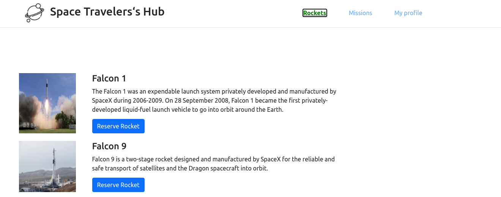
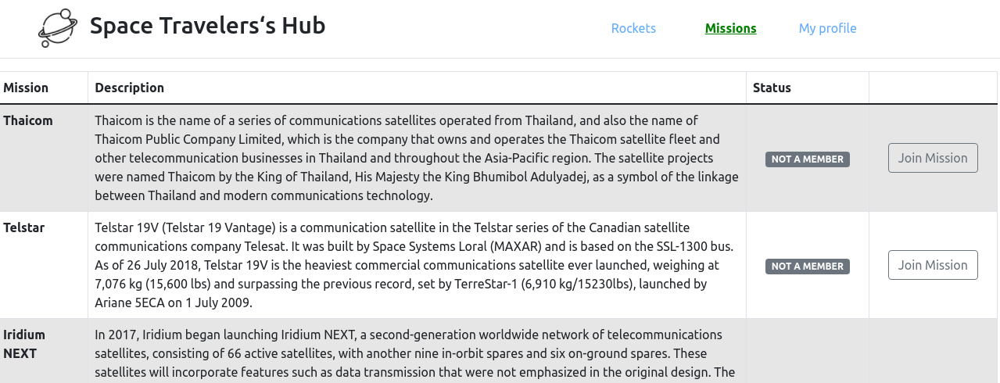

# Space-travelers-hub
This is a React web application for a company that provides commercial and scientific space travel services. 





Additional description of the project and its features.

## 🔴  Live Demo

[Space-travelers-hub](https://vigorous-jang-d9676c.netlify.app)

## Project Overview Video

[Watch Here](https://drive.google.com/file/d/1ET6WM92e4OX3g3r_24C-X2K7tple-MaH/view?usp=sharing)

## Built With

- HTML
- CSS
- React
- Redux

## Getting Started

To get a local copy up and running follow these simple steps inside the root folder.

### Setup

Install dependencies with:

```
npm install
```

### Usage

Start server with:

```
npm start
```

it will open `http://localhost:3000/` in your default browser.

## Authors

👤 **Onesis Olea**

- Github: [2bleO](https://github.com/2bleO)
- Linkedin: [Onesis Olea](https://www.linkedin.com/in/onesis-olea/)
- Twitter: [@OleaOnesis](https://twitter.com/OleaOnesis)

👤 **Erez Friemagor**

Github: [@erezfree29](https://github.com/erezfree29)

Twitter: [@friemagor](https://twitter.com/friemagor)

LinkedIn: [Stephan Annandale](https://www.linkedin.com/in/erez-friemagor/)

## 🤝 Contributing

Contributions, issues and feature requests are welcome!

Feel free to check the [issues page]().

## Show your support

Give a ⭐️ if you like this project!

## Acknowledgments

- Microverse

## 📝 License

This project is MIT Lisenced